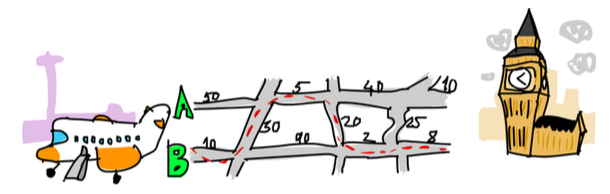
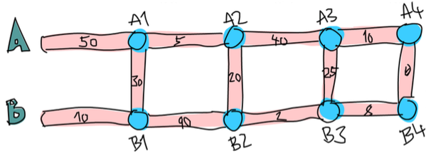

Problem Description
===================
Suppose that we’re on a business trip. Our plane has just landed in England, and we rent a car. We have a meeting really soon, and we need to get from Heathrow Airport to London as fast as we can (but safely!).

There are two main roads going from Heathrow to London, and a num- ber of regional roads cross them. It takes a fixed amount of time to travel from one crossroad to another. It’s up to us to find the optimal path to take so that we get to our meeting in London on time. We start on the left side and can either cross to the other main road or go forward.

As you can see in the picture, the quickest path from Heathrow to London in this case is to start on main road B, cross over, go forward on A, cross over again, and then go forward twice on B. If we take this path, it takes us 75 minutes. Had we chosen any other path, it would take longer.

Our job is to make a program that takes input that represents a road sys- tem and prints out the quickest path across it. Here’s what the input would look like for this case:

50   
10   
30   
5   
90   
20   
40   
2   
25   
10   
8   
0   

To parse the input file, read in the numbers in threes and split the road system into sections. Each section is composed of road A, road B, and a crossing road. To have it neatly fit into threes, we say that there’s a last crossing section that takes 0 minutes to drive over. That’s because we don’t care where we arrive in London, as long as we’re in London, mate!

Just as we did when considering the RPN calculator problem, we’ll solve this problem in three steps:

1. Forget programming for a minute and think about how to solve the problem by hand.

2. Think about how we’re going to represent our data.

3. Figure out how to operate on that data so that we produce a solution.

Calculating the Quickest Path
-----------------------------
So how do we figure out the quickest path from Heathrow to London? 

Here’s a simplified picture of our road system:

Can we figure out the quickest path to the first crossroads (the first dot on A, marked A1) on road A?
That’s pretty trivial. 
We just see if it’s faster to go directly forward on A or to go forward on B and then cross over. 

In this case it’s faster to go forward via B and then cross over, because that takes 40 minutes, whereas going directly via A takes 50 minutes. 
What about crossroads B1? We see that it’s a lot faster to just go directly via B (incurring a cost of 10 minutes), because going via A and then crossing over would take us 80 minutes!

Now we know the quickest path to A1: Go via B and then cross over. We’ll say that’s path B, C with a cost of 40 minutes. 

We also know the quickest path to B1: Go directly via B. So that’s a path consisting just of B for 10 minutes. 

Does this knowledge help us at all if we want to know the quickest path to the next crossroads on both main roads? 
Gee golly, it sure does!

Let’s see what the quickest path to A2 would be. 
To get to A2, we’ll either go directly to A2 from A1 or we’ll go forward from B1 and then cross over (re- member that we can only move forward or cross to the other side). 
Beause we know the cost to A1 and B1, we can easily figure out the best path to A2. 

It takes us 40 minutes to get to A1 and then 5 minutes to get from A1 to A2, so that’s path B, C, A, for a cost of 45. 
It takes us only 10 minutes to get to B1, but then it would take an additional 110 minutes to go to B2 and then cross over! 

So obviously, the quickest path to A2 is B, C, A. 

In the same way, the quickest way to B2 is to go forward from A1 and then cross over.

Maybe you’re asking yourself, “But what about getting to A2 by first crossing over at B1 and then going forward?” Well, we already covered crossing from B1 to A1 when we were looking for the best way to A1, so we don’t need to take that into account in the next step as well.

Now that we have the best path to A2 and B2, we can repeat this until we reach the end. Once we have calculated the best paths for A4 and B4, the one that takes less time is the optimal path.
So in essence, for the second section, we just repeat the step we did at first, but we take into account the previous best paths on A and B. We could say that we also took into account the best paths on A and on B in the first step—they were both empty paths with a cost of 0 minutes.

###Summary
In summary, to get the best path from Heathrow to London, we do this:
1. We see what the best path to the next crossroads on main road A is. The two options are going directly forward or starting at the opposite road, going forward and then crossing over. We remember the cost and
the path.

2. We use the same method to find the best path to the next crossroads on main road B and remember that.

3. We see if the path to the next crossroads on A takes less time if we go from the previous A crossroads or if we go from the previous B crossroads and then cross over. We remember the quicker path. We do the same for the crossroads opposite of it.

4. We do this for every section until we reach the end.

5. Once we’ve reached the end, the quicker of the two paths that we have is our optimal path.

So, in essence, we keep one quickest path on the A road and one quickest path on the B road. 
When we reach the end, the quicker of those two is our path.
We now know how to figure out the quickest path by hand. 
If you had enough time, paper, and pencils, you could figure out the quickest path through a road system with any number of sections.

